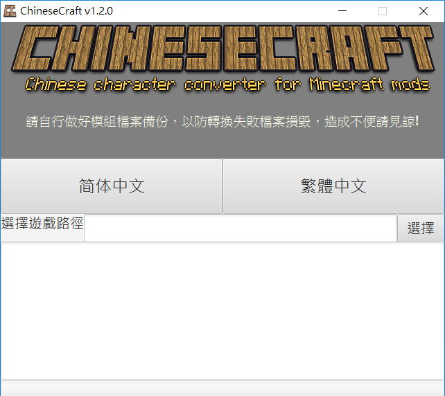

# ChineseCraft
ChineseCraft 是一個為了麥塊模組而生的中文繁簡轉換工具

有鑒於目前許多模組缺乏繁體中文翻譯者，而相對簡體中文擁有較多的翻譯資源，因此開發了這個工具將簡體中文直接轉譯為繁體中文。用字遣詞上並沒有做修改，純屬字元部分的轉換。方便繁體中文的玩家一個稍微友善的遊戲環境。

(也可以將繁體中文轉譯至簡體中文)

## 注意
> 使用前請先做好模組**檔案備份**!

## 下載
- [Github Release](https://github.com/momocow/ChineseCraft/releases/latest)

## 使用方式
- 下載執行檔
- 選擇遊戲路徑
- 選擇目標語言 (繁體/簡體)
- 等待完成

## 遊戲愉快!